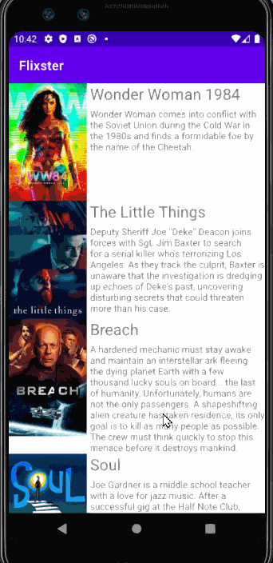
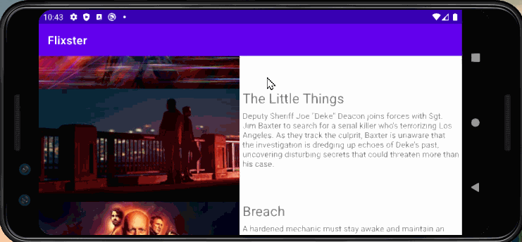

# App - *Flixster Movie App*

**Flixster** is an android app that shows the latest movies that are currently playing in theatres now!
The app uses the MovieDB API to find which movies are currently playing and displays the appropriate list of movies with their promotional pictures, title, and summary.

## Video Walkthrough

## Here's a walkthrough of the app in Portrait mode:

## Landscape Mode:

GIF created with [LiceCap](http://www.cockos.com/licecap/).

Submitted by: **Umar Kagzi**

Time spent: **5** hours spent in total

## User Stories

The following **required** functionality is completed:

* [x] All required items are included.

The following **additional** features are implemented:

* [x] Enhanced UI, Landscape Mode

## Notes

Describe any challenges encountered while building the app.

I did encounter a few hurdles while building the app but was able to resolve the issues by reading the documentation and user feedback.

## License

    Copyright [2021] [Umar Kagzi]

    Licensed under the MIT License.
